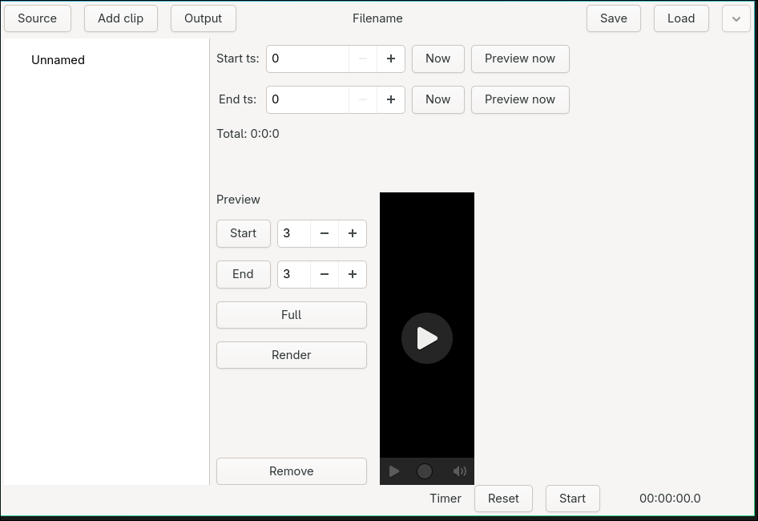
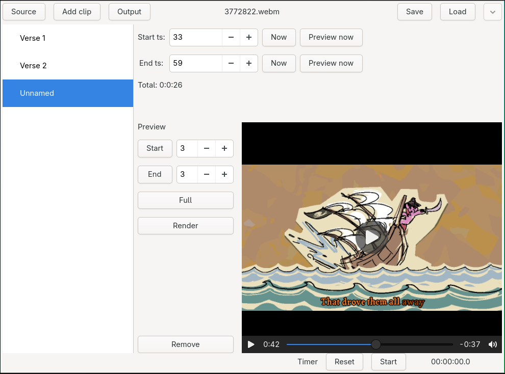

# Streamripper
---

**Streamripper** - это программа для нарезания фрагментов из видеофайла, в том числе в процессе его записи.

Основная идея использования программы состоит в облегчении вырезки лучших моментов с прямой трансляции во время её протекания.

## Скриншоты

## Возможности
- Размечать клипы из записываемого видео
- Осуществлять предпросмотр клипов
- Сохранять и загружать размеченные клипы (Json)
- Рендерить клипы в готовые видеоотрывки
- По аналогии допускается работа с аудиофайлами

## Особенности
- Написана на языке `C` с использованием `GTK`
- Кроссплатформенна
- В качестве бекенда для нарезки используется `FFMPEG`
- Для сохранения и загруки размеченных клипов используется [**собственная Json-библиотека**](https://github.com/shybu8/C-JSON-Serializer-Deserializer)
